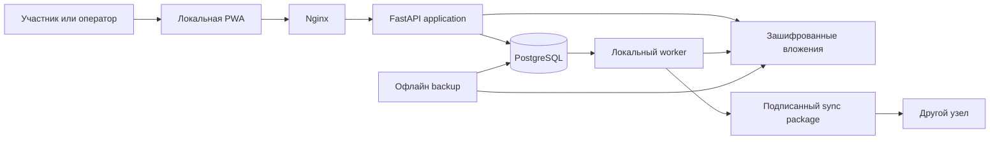

# Архитектура системы

Статус: обязательная архитектура production-реализации.

## Цели

- сохранить локальные хозяйственные операции при потере Интернета и внешних
  сервисов;
- доказуемо связать состояние с подписанными событиями и людьми;
- ограничить финансовый и паевой ущерб до заранее известной экспозиции;
- восстановить узел, ключи, журнал и вложения на резервном оборудовании;
- позволить независимый аудит без раскрытия лишних персональных данных;
- постепенно объединять узлы без потери локальной автономии.

## Архитектурный стиль

Система является модульным монолитом с лёгким разделением команд и чтения.

- команды проходят через application services и доменные модели;
- запросы читают представления PostgreSQL и подготовленные read models;
- модуль не изменяет таблицы другого модуля напрямую;
- взаимодействие модулей выполняется контрактами и доменными событиями;
- полный event sourcing не применяется;
- signed event journal не является очередью и не заменяет текущее состояние;
- PostgreSQL является единственным обязательным stateful-сервисом.

## Контекст системы



## Компоненты локального узла

| Компонент | Обязанность | Обязателен |
|---|---|---|
| Nginx | TLS, frontend, reverse proxy, лимиты запросов | Да |
| API | Авторизация, команды, запросы, OpenAPI | Да |
| Worker | Outbox, отчёты, пакеты, проверки целостности | Да |
| PostgreSQL | Состояние, журнал, outbox, audit, read models | Да |
| Blob store | Зашифрованные документы и доказательства | Да |
| Redis/RabbitMQ | Ускорение необязательных задач | Нет |
| Внешний OIDC | Дополнительная идентификация | Нет |
| SaaS observability | Запрещён как обязательная зависимость | Нет |

## Слои backend

```text
api -> application -> domain -> ports
                      ^          |
                      |          v
                 infrastructure/adapters
```

- `api`: HTTP, схемы запроса, scopes, idempotency, перевод ошибок;
- `application`: use cases, транзакционные границы, orchestration;
- `domain`: агрегаты, value objects, переходы состояний, инварианты;
- `ports`: интерфейсы репозиториев, подписания, времени, файлов;
- `infrastructure`: SQLAlchemy, crypto adapters, blob store, workers.

Domain не импортирует FastAPI, SQLAlchemy, HTTP-клиенты или файловую систему.

## Путь критической команды

1. API проверяет формат, сессию, роль и `Idempotency-Key`.
2. Application service открывает транзакцию.
3. Нужные агрегаты блокируются в стабильном порядке.
4. Domain проверяет состояние, лимиты, полномочия и экспозицию.
5. Репозиторий сохраняет актуальное состояние.
6. В той же транзакции добавляются event journal, audit и outbox.
7. После commit возвращается `event_id` и новое представление объекта.
8. Worker доставляет уведомления и строит пакеты независимо от HTTP-запроса.

Ответ не сообщает об успехе до commit. Сбой worker после commit не отменяет
хозяйственное событие.

## Контуры данных

1. Операционный: изменяемые таблицы актуального состояния.
2. Доказательный: добавляемый signed event journal.
3. Аудиторский: кто и с какого рабочего места обращался к системе.
4. Файловый: зашифрованные вложения по хешу содержимого.
5. Интеграционный: outbox/inbox и пакеты синхронизации.
6. Аналитический: перестраиваемые read models без юридической силы.

## Доверительные границы

- браузер считается потенциально скомпрометированным клиентом;
- API не доверяет данным UI и повторяет все проверки;
- локальный администратор не переписывает журнал штатными средствами;
- импортируемый пакет недоверенный до полной проверки;
- вложение недоверенное до проверки типа, размера, хеша и политики;
- подпись доказывает заявление, но не истинность физического факта без
  независимых доказательств.

## Масштабирование

До доказанной необходимости используются вертикальное масштабирование и
read-only реплики для отчётов. Выделение сервиса допустимо только при наличии
измеренного узкого места, стабильного контракта, независимого жизненного цикла
данных и плана работы при недоступности сервиса.

Clearing engine может стать отдельным процессом, но остаётся чистой
детерминированной библиотекой с тем же форматом входа и доказательства.

## Запрещённые решения

- бизнес-правила в React-компонентах;
- прямые SQL-изменения таблиц соседнего модуля;
- денежные и количественные расчёты через float;
- last-write-wins для экономических конфликтов;
- удаление событий для исправления ошибки;
- взыскание сверх зафиксированной экспозиции;
- зависимость критического пути от CDN, брокера, блокчейна или облака;
- единый непрозрачный рейтинг человека;
- необратимая миграция без проверенного восстановления.
