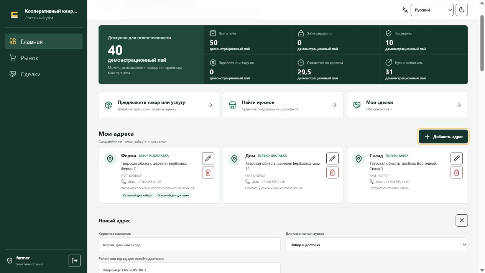
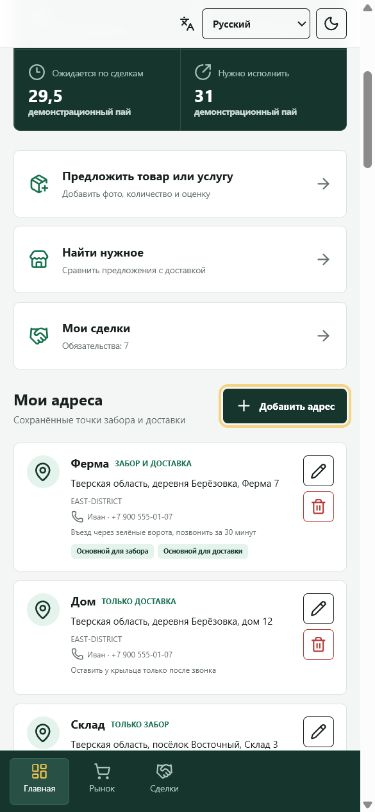
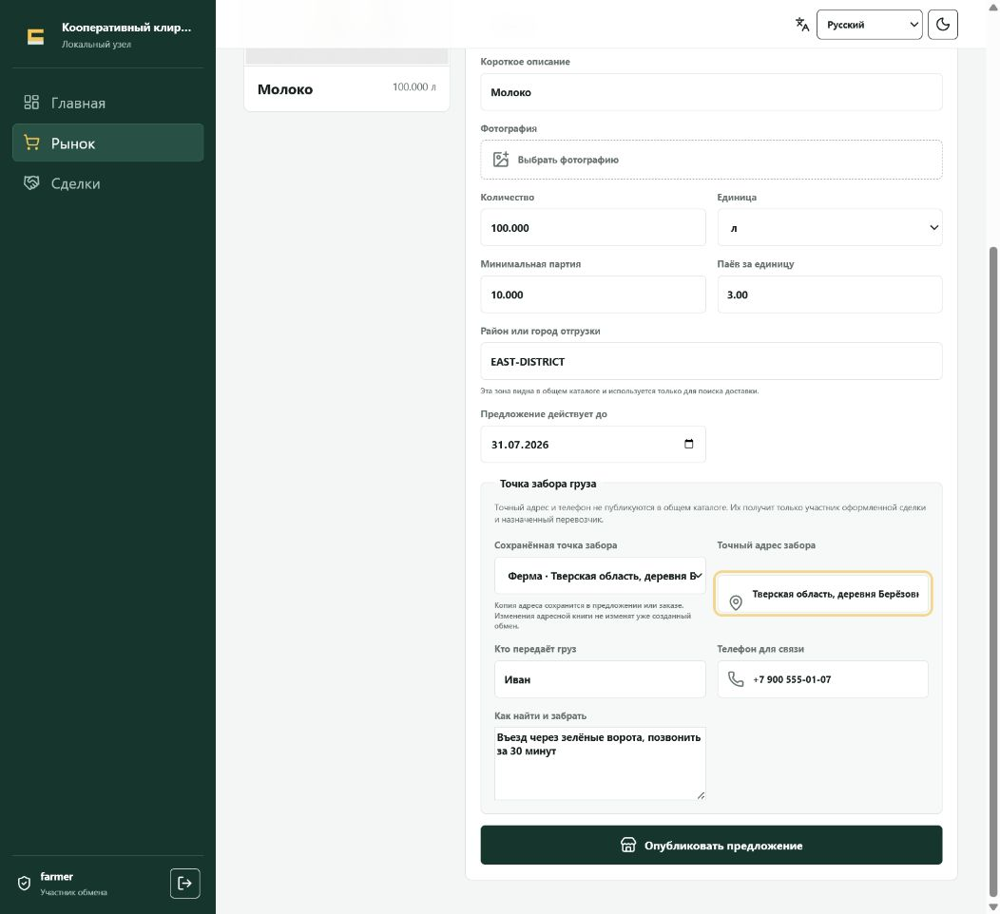
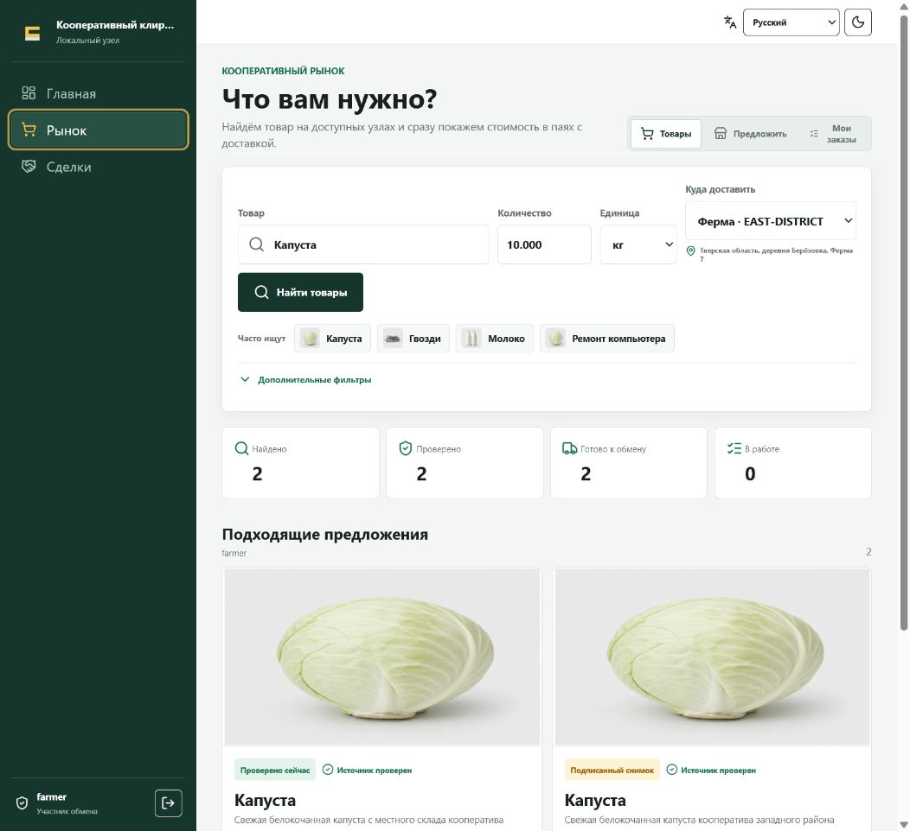
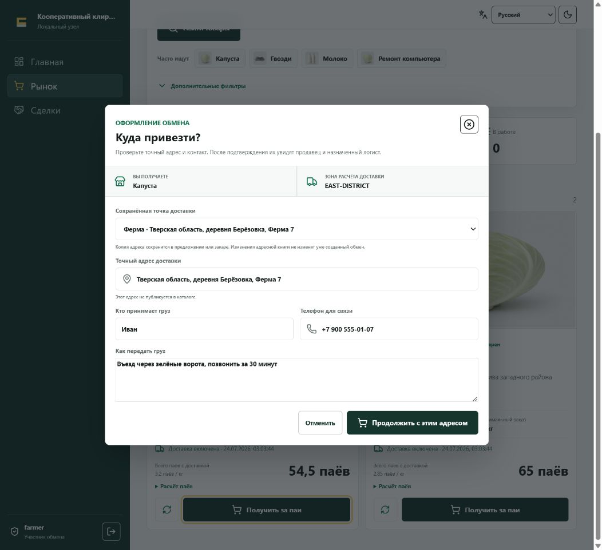
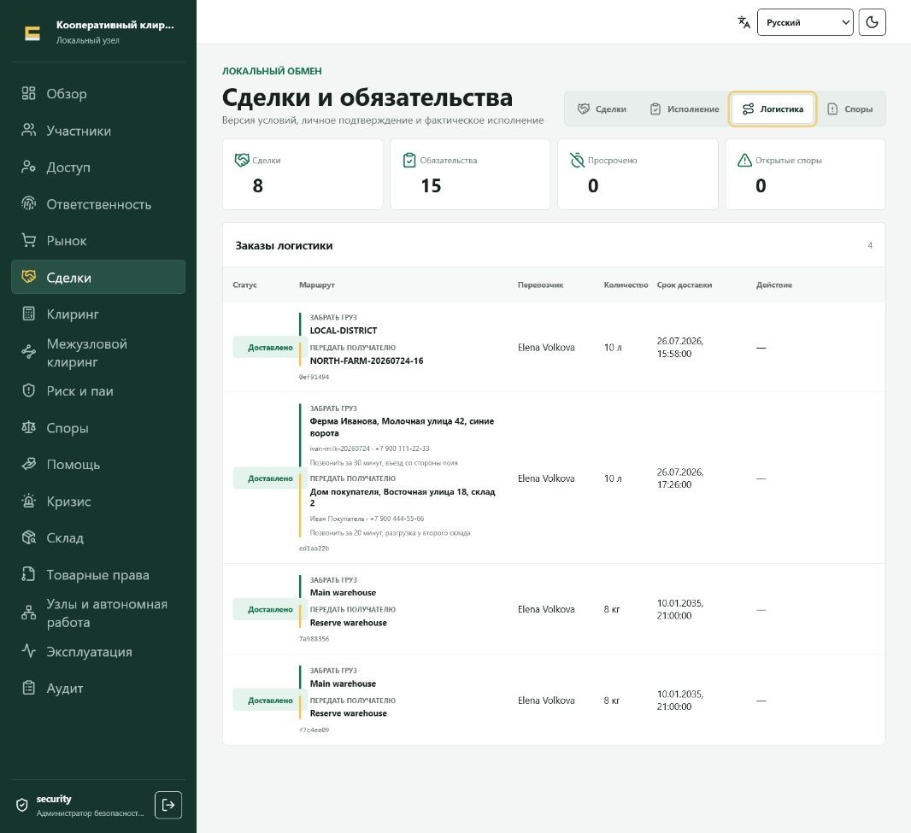
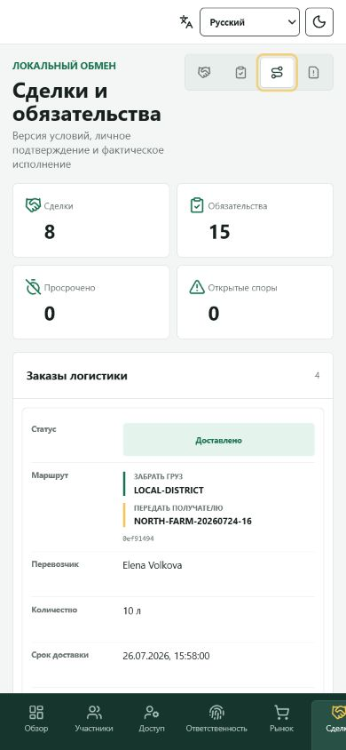

# Адреса забора и доставки

Практический сценарий проверен в работающей демонстрационной системе 24 июля
2026 года. Точные адреса не публикуются в общем каталоге: продавец указывает
точку забора, покупатель указывает точку доставки, а назначенный логист получает
обе точки только после подтверждения обмена.

## Кто и где указывает адрес

| Участник | Где указывает | За что отвечает |
|---|---|---|
| Продавец | в личной адресной книге и в форме предложения | точный адрес забора, контакт, доступ к грузу и инструкции для погрузки |
| Покупатель | в личной адресной книге, перед поиском и при оформлении | точный адрес доставки, получатель, телефон и инструкции для разгрузки |
| Логист | не переписывает адреса сторон; проверяет их в назначенном рейсе | конфиденциальность, выполнимость маршрута и сохранность груза между актами |

## 1. Сохранить свои точки

На **Главной** есть раздел **Мои адреса**. Участник может создать точки
**Ферма**, **Дом**, **Склад** или дать им другие понятные названия. Для каждой
точки задаются:

- назначение для забора, доставки или обоих вариантов;
- публичный район для расчёта логистики;
- точный адрес;
- контактное лицо и телефон;
- инструкции для въезда, погрузки или разгрузки;
- признак основной точки.

На телефоне те же карточки выстраиваются в одну колонку без горизонтальной
прокрутки.

## 2. Продавец выбирает точку забора

При публикации товара или услуги продавец выбирает сохранённую точку либо вводит
разовую. Район виден в каталоге, а точный адрес, телефон и инструкции остаются
закрытыми.

Перед публикацией нужно проверить, что груз реально можно забрать в указанное
время, подъезд открыт, а контактный человек будет на месте.

## 3. Покупатель выбирает точку доставки

Покупатель выбирает точку доставки до поиска. Благодаря этому предложения
сравниваются для правильного района, а полная оценка учитывает нужный маршрут.

После нажатия **Получить за паи** покупатель ещё раз видит точный адрес,
получателя, телефон и инструкции. Обмен не подтверждается, пока обязательные
поля не заполнены.

## 4. Что видит логист

До назначения логист рассчитывает перевозку только между публичными районами.
После подтверждения обмена в **Сделки → Логистика** назначенному перевозчику
раскрываются:

- точный адрес и контакт продавца;
- инструкции для забора;
- точный адрес и контакт покупателя;
- инструкции для доставки;
- количество, срок и следующий допустимый шаг.

На телефоне каждый рейс показан отдельной вертикальной карточкой: статус,
маршрут, перевозчик, количество, срок и доступное действие не требуют
горизонтальной прокрутки.

Другой логист не получает этот рейс и не видит его точные адреса только из-за
наличия роли **Логист**.

## Почему адрес копируется в сделку

При выборе сохранённой точки система копирует её значения в предложение или
заказ. Получается неизменяемый снимок. Если завтра владелец изменит **Дом** или
архивирует **Склад**, старый подтверждённый обмен не перепишется.

Если точная точка не соответствует району расчёта, проезд невозможен или
появились новые требования к перевозке, логист не меняет цену молча. Рейс
отклоняется либо стороны подписывают новый расчёт.

## English summary

The seller selects a private pickup point while publishing an offer. The buyer
selects a delivery point before search and confirms its exact contact details at
checkout. Public search and logistics quotes use only routing areas. Exact
pickup and delivery snapshots are disclosed to the assigned carrier only after
the exchange is committed.

Saved places are copied into offers and orders. Editing or archiving a profile
entry never rewrites an existing transaction.