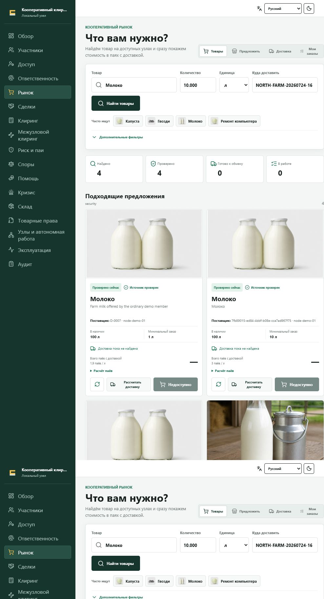
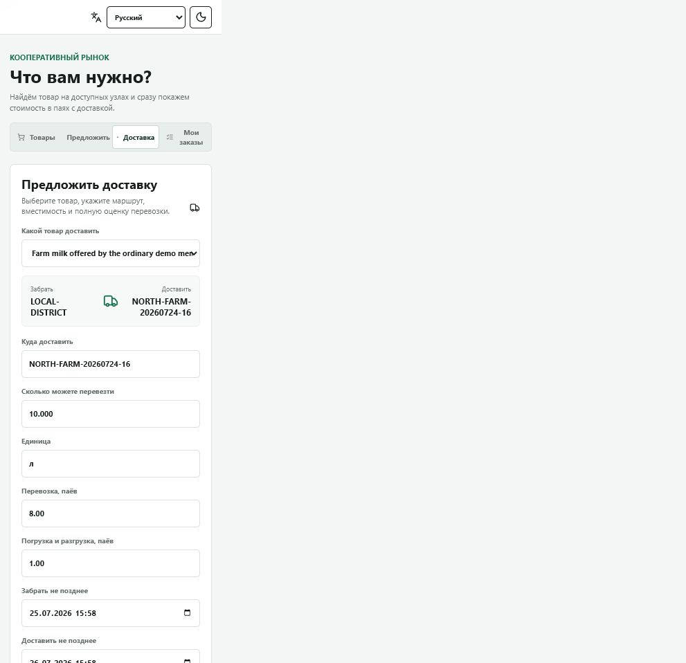
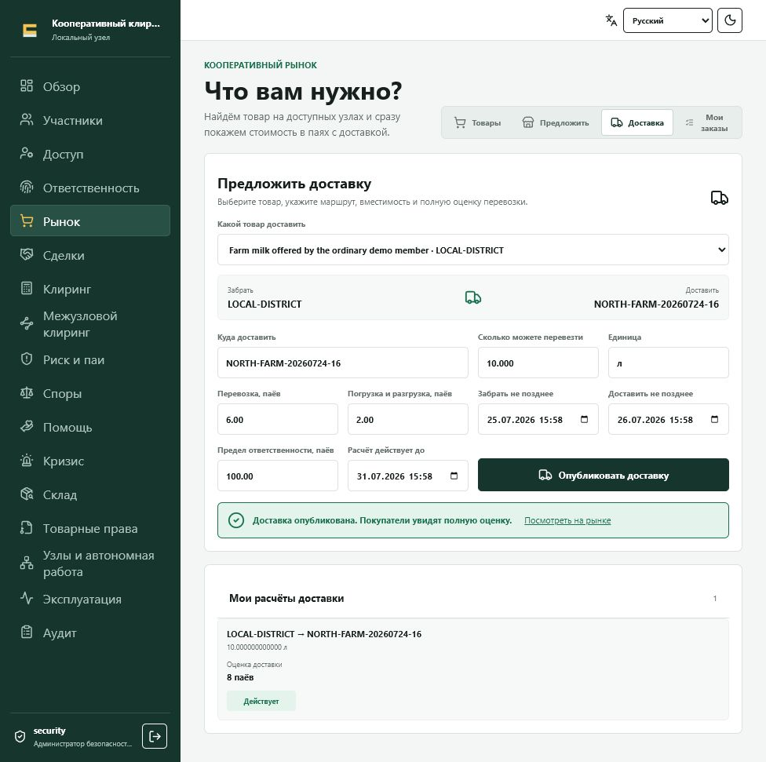
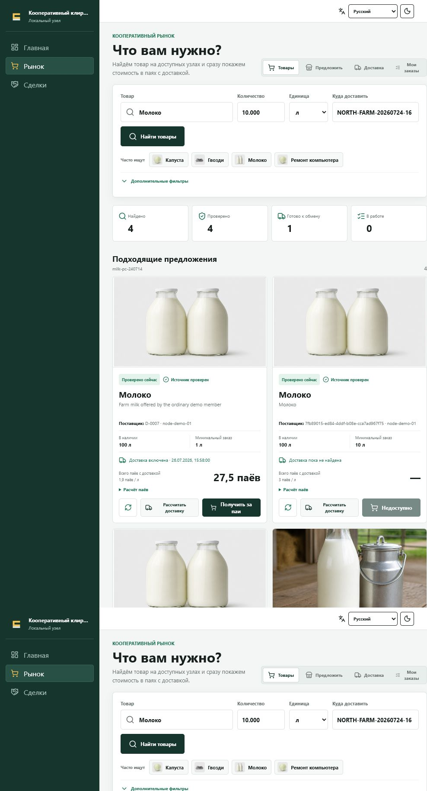
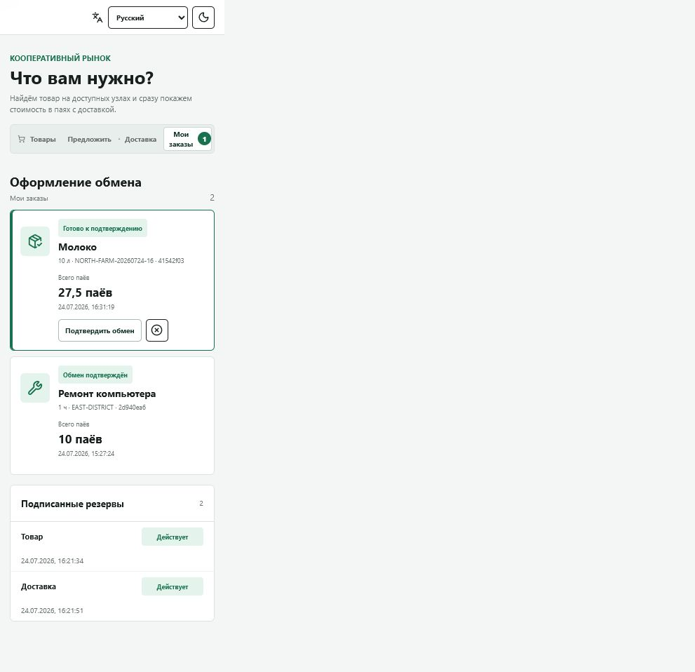
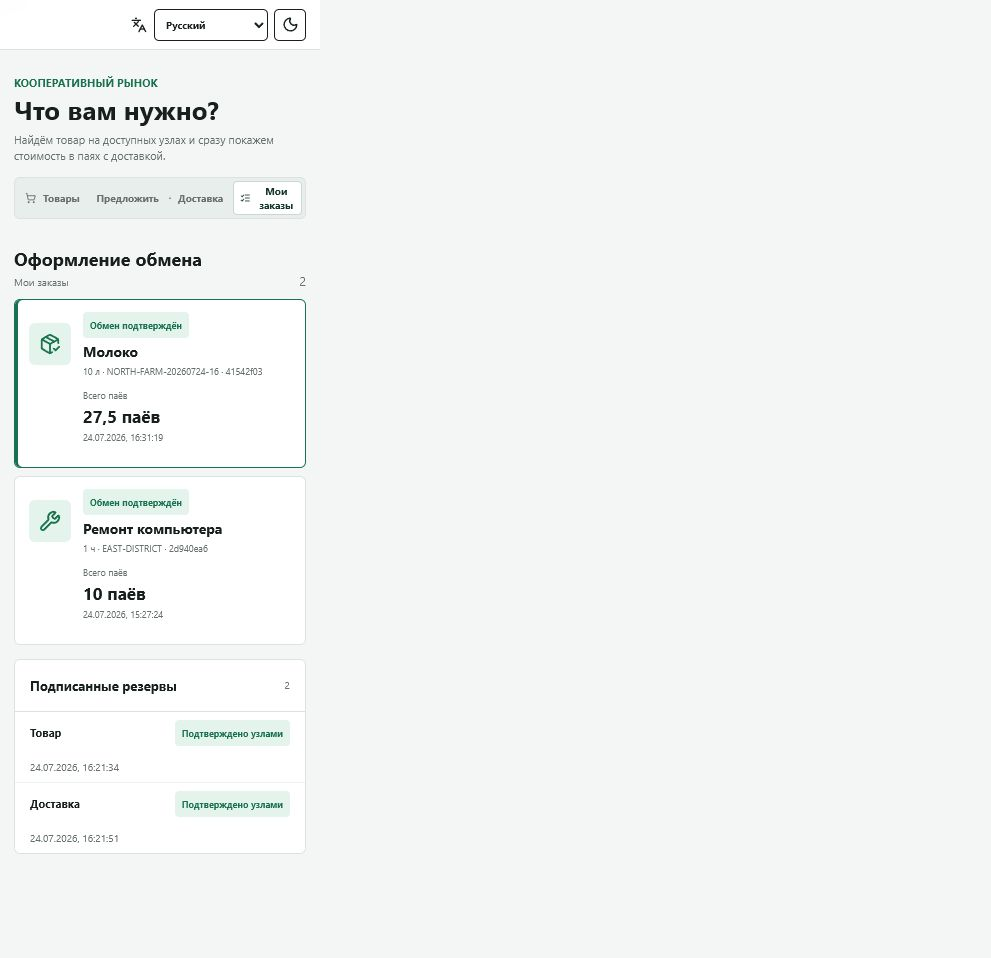
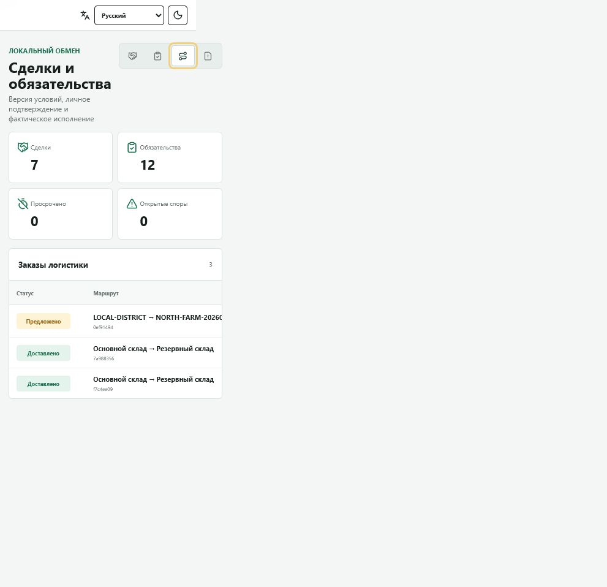
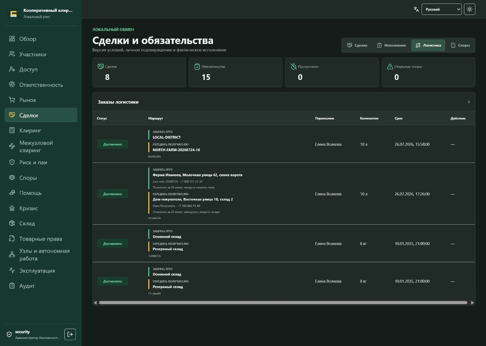
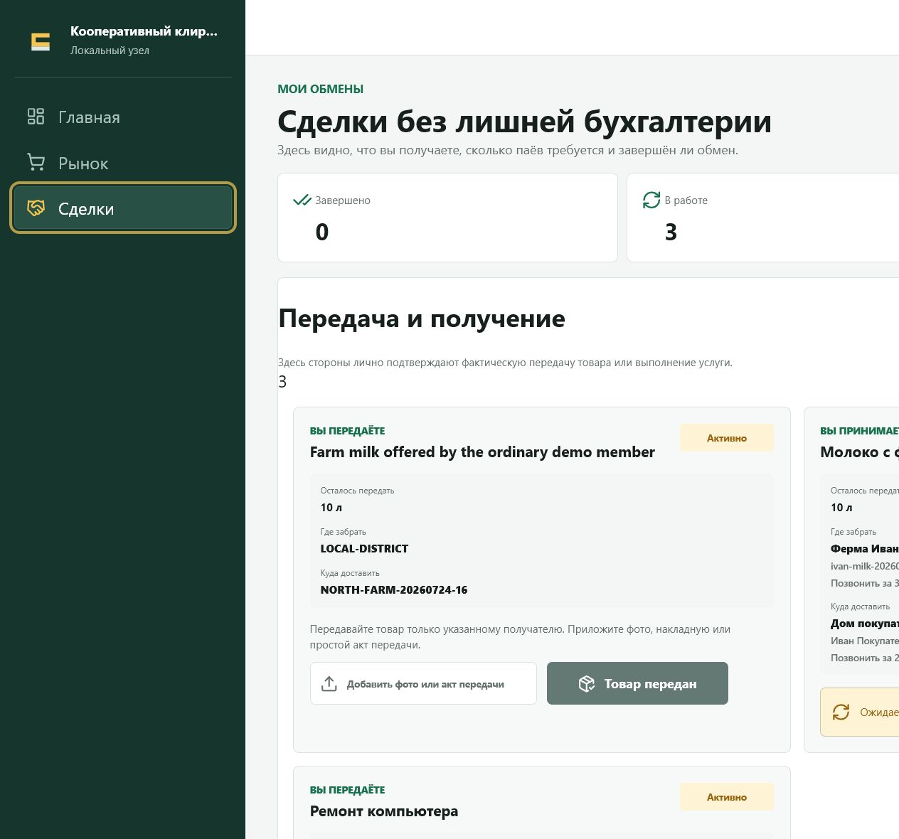
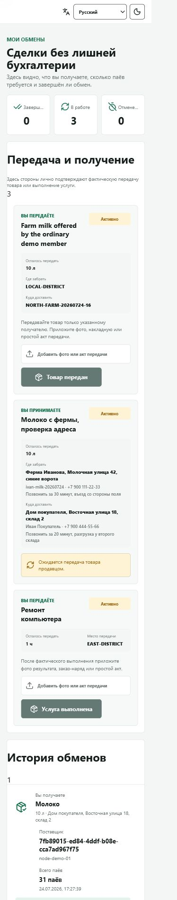

# Пример: доставка молока отдельным логистом

Этот сценарий полностью пройден в работающей демонстрационной системе 24 июля 2026 года. Фермер уже предложил молоко, отдельный логист рассчитал перевозку, покупатель подтвердил обмен, а логист принял рейс, зарегистрировал погрузку и доставку.

> Логистика является самостоятельным обязательством. Покупатель видит её оценку отдельно от оценки товара, а выполнить перевозку может только тот пайщик, от имени которого подписан расчёт доставки.

## Участники

| Кто | Что делает |
|---|---|
| Фермер | предлагает 100 литров молока по 1,9 пая за литр |
| Логист Елена Волкова | рассчитывает и выполняет перевозку |
| Покупатель | заказывает 10 литров молока с доставкой |
| Система | связывает подписанные резервы с одной сделкой и создаёт рейс |

Маршрут предварительного расчёта: `LOCAL-DISTRICT → NORTH-FARM-20260724-16`.
Это публичные зоны, а не домашние адреса. Точный адрес фермы не показывается в
каталоге, а адрес покупателя ещё не существует в заказе до оформления.

Подробно о личной адресной книге, выборе точек продавцом и покупателем и
неизменяемых снимках: [Адреса забора и доставки](addresses-and-delivery.md).

## 1. Логист находит груз

Логист входит под собственной учётной записью с ролью **Логист**, открывает **Рынок**, выбирает **Молоко** и указывает район назначения.

Карточка фермера показывает товар и оценку, но обмен недоступен, пока для этого маршрута нет доставки.

Логист нажимает **Рассчитать доставку**. Это не покупка товара: кнопка открывает рабочее место перевозчика.

## 2. Логист рассчитывает доставку

В форме уже указаны товар, место погрузки, место назначения, количество и единица измерения. Логист указывает:

- сколько груза может перевезти;
- оценку перевозки;
- оценку погрузки и разгрузки;
- сроки погрузки и доставки;
- предел личной ответственности;
- срок действия расчёта.

В примере перевозка оценена в 6 паёв, погрузка и разгрузка в 2 пая, а предел ответственности составляет 100 паёв.

После нажатия **Опубликовать доставку** появляется подписанный расчёт маршрута. В списке **Мои расчёты доставки** логист видит маршрут, вместимость, оценку и статус.

## 3. Покупатель проверяет полный итог

Покупатель ищет 10 литров молока в тот же район. Карточка показывает уже не только цену товара, но и полный итог с доставкой:

- молоко: 19 паёв;
- перевозка и погрузка: 8 паёв;
- обязательные сборы: 0,5 пая;
- всего: 27,5 пая.

Покупатель нажимает **Получить за паи**. В отдельном окне оформления он указывает
точный адрес доставки, имя и телефон получателя, а также инструкции для въезда
или разгрузки. Эти данные сохраняются в конкретном заказе, но не публикуются в
поиске. Затем покупатель последовательно:

1. резервирует товар;
2. резервирует доставку;
3. проверяет два подписанных резерва и точку доставки;
4. подтверждает обмен.

До последнего шага товар и перевозка только удерживаются. Если подтверждение не состоится, резервы можно освободить без создания сделки.

После подтверждения оба резерва получают статус **Подтверждено узлами**.

## 4. У логиста появляется рейс

После подтверждения система создаёт три связанных обязательства:

1. фермер должен передать молоко покупателю;
2. покупатель должен предоставить фермеру согласованный паевой эквивалент;
3. покупатель должен предоставить логисту 8 паёв за перевозку.

Одновременно создаётся заказ логистики, связанный с товарным обязательством. Перевозчиком назначается не произвольный оператор, а участник, подписавший выбранный покупателем расчёт.

В **Сделки → Логистика** Елена Волкова видит новый маршрут со статусом
**Предложено**. Только теперь ей раскрываются две рабочие точки:

- **Забрать:** точный адрес фермы, имя и телефон продавца, инструкции для въезда;
- **Доставить:** точный адрес покупателя, имя и телефон получателя, инструкции
  для разгрузки.

На телефоне тот же рейс показан вертикальной карточкой без горизонтальной
прокрутки.

Елена сверяет возможность проезда и нажимает **Принять перевозку**. Если точный адрес не
соответствует зоне расчёта или проезд невозможен, она не меняет цену молча, а
отклоняет рейс для повторного согласования.

После принятия другой пользователь уже не может исполнить этот рейс от её имени.

## 5. Погрузка и доставка

Для погрузки логист нажимает **Добавить акт забора**, выбирает документ или фотографию и затем нажимает **Подтвердить забор**. Статус меняется на **В пути**.

Для завершения логист нажимает **Добавить акт доставки** и выбирает новый файл. После его загрузки он нажимает
**Сообщить о доставке**. Это заявление перевозчика о передаче, но не
одностороннее закрытие товарного обязательства: покупатель отдельно подтверждает
получение и количество либо открывает спор.

## 6. Продавец передаёт, покупатель принимает

После статуса рейса **Доставлено** у продавца в разделе **Сделки** появляется карточка товара с точкой передачи и остатком. Продавец выбирает **Добавить фото или акт передачи**, прикладывает файл и нажимает **Товар передан**. Это персональное заявление продавца, связанное с доставленным рейсом.

На телефоне те же данные выстраиваются в одну колонку без горизонтальной прокрутки:

У покупателя в той же карточке появляется заявленное продавцом количество. До подтверждения он проверяет груз и указывает:

- фактически принятое количество;
- состояние: всё в порядке, недостача или повреждение, либо полный отказ;
- комментарий и собственное фото или акт приёмки.

Кнопка **Подтвердить получение** закрывает только фактически принятое количество. При частичной приёмке остаток остаётся обязательством, а расхождение может быть передано в спор. Полный отказ фиксирует нулевое принятое количество и не выдаёт продавцу подтверждение полного исполнения.

Акты не заменяют фактическую передачу товара. Они делают её проверяемой: сохраняются автор действия, время, файл-доказательство, маршрут и неизменяемое событие журнала. Посторонний логист не видит эти акты; доступ имеют стороны, назначенный перевозчик и уполномоченный администратор или аудитор.

## Ответственность логиста

- расчёт подписан конкретным пользователем и связан с его пайщиком;
- заказ назначен этому же перевозчику;
- принять, забрать и доставить груз может только назначенный логист;
- предел ответственности фиксируется до подтверждения покупателем;
- для погрузки и доставки нужны отдельные доказательства;
- просрочка, недостача или неподтверждённая передача могут стать основанием для спора, изменения репутации и обращения взыскания на предусмотренное обеспечение;
- история не удаляется при отзыве роли или закрытии учётной записи.

## Что проверено

- логист самостоятельно публикует расчёт из своего кабинета;
- покупатель видит товар, доставку и сборы раздельно;
- товар и доставка резервируются до окончательного подтверждения;
- рейс создаётся автоматически после сделки;
- рейс получает именно подписавший расчёт перевозчик;
- общий каталог и другие логисты не видят точные адреса и телефоны;
- назначенный перевозчик получает обе точки и контакты только после создания рейса;
- каждый физический этап требует доказательства;
- повторное нажатие безопасно контролируется текущим статусом заказа.
- после доставки продавец отдельно подтверждает передачу, а покупатель отдельно фиксирует количество и состояние;
- посторонний логист не видит акты исполнения сторон.

---

## English summary

This walkthrough was completed against the running demo on 24 July 2026. A carrier found a milk offer, published a signed delivery quote, and became the named carrier after the buyer committed the exchange.

The buyer reserved goods and logistics separately and saw a delivered total of 27.5 shares. The system then created the goods, reciprocal-value, and carrier-value obligations plus a logistics order linked to the goods obligation.

Only the named carrier could accept the route, record pickup, and record delivery. Pickup and delivery required separate evidence files. The route status then became **Delivered**, but that did not close the goods obligation. The supplier separately recorded handover evidence, and the recipient recorded the quantity and condition actually received. Only the accepted quantity completed the goods obligation.